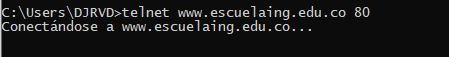
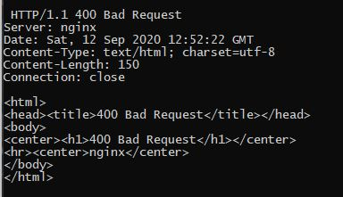
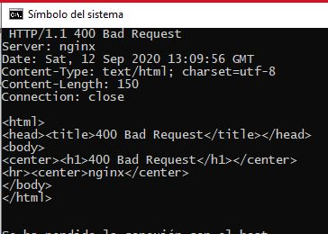
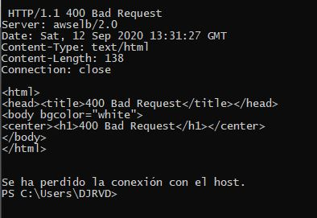

# Laboratorio 5 - MVC Primefaces Introduction - 2020-2

**********************************************************
----------------------------------------------------------
**********************************************************
# LAB5-CVDS

### Datos básicos
 * **Nombres:** David Fernando Rivera\
				Janer Stiven Vanegas
				
				
**********************************************************
----------------------------------------------------------
**********************************************************
## Parte I. - Jugando a ser un cliente HTTP

1. Abra una terminal Linux o consola de comandos Windows.
2. Realice una conexión síncrona TCP/IP a través de Telnet al siguiente servidor:
	* Host: www.escuelaing.edu.co
	* Puerto: 80
	Teniendo en cuenta los parámetros del comando telnet:
		```telnet HOST PORT```
		```telnet www.escuelaing.edu.co 80```
	
	
	
3. Antes de que el servidor cierre la conexión por falta de comunicación:
	* Revise la página 36 del RFC del protocolo HTTP, sobre cómo realizar una petición GET. Con esto, solicite al servidor el recurso ‘sssss/abc.html’, usando la versión 1.0 de HTTP.
	* Asegúrese de presionar ENTER dos veces después de ingresar el comando.
	* Revise el resultado obtenido. ¿Qué codigo de error sale?, revise el significado del mismo en la lista de códigos de estado HTTP.
		```GET http://www.escuelaing.edu.co/sssss/abc.html HTTP/1.0```
		
	
		* ***400 Bad Request:*** Con los códigos de estado, un servidor web es capaz de devolver al cliente el estado actual de las solicitudes.
	
		
	* ¿Qué otros códigos de error existen?, ¿En qué caso se manejarán?
	
	
		
	
	Hay 5 tipos de estado los de tipo 100 hasta lod de tipo 500

		* Codigo de estado 100: 
		Son errores informaticos indicando que la peticion se ha recibido y se continua el proceso 100 ... 103 .


		* Codigo de esado 200: 
		Estos codigos indican que todo a salido correctamente 200 ... 208
		
		* Codigo de estado 300:
		Estan relacionados con redirecciones. Los servidores usan estos codigos para indicar al navegador que la pagina o recurso que han pedido se ha movido de sitio 300 ... 308 .

		* Codigo de estado 400:
		Corresponden a errores de cliente el mas conocido error 404 que aparece cuado la pagina que se intento busccar no existe 400 ... 452 .

		* Codigo de estado 500:
		Son errores por parte del servidor. Es posible que el servidor tenga algun problema temporal y no hay mucho que se pueda hacer, 500 ... 511 
	

4. Realice una nueva conexión con telnet, esta vez a:
	* Host: www.httpbin.org
	* Puerto: 80
	* Versión HTTP: 1.1
	* Ahora, solicite (GET) el recurso /html. ¿Qué se obtiene como resultado?
		```telnet www.httpbin.org 80```
		```GET www.httpbin.org/html HTTP/1.1```
	
		
		
	¡Muy bien!, ¡Acaba de usar del protocolo HTTP sin un navegador Web!. Cada vez que se usa un navegador, éste se conecta a un servidor HTTP, envía peticiones (del protocolo HTTP), espera el resultado de las mismas, y -si se trata de contenido HTML- lo interpreta y dibuja.

5. Seleccione el contenido HTML de la respuesta y copielo al cortapapeles CTRL-SHIFT-C. Ejecute el comando wc (word count) para contar palabras con la opción -c para contar el número de caracteres:

	```wc -c```
	
	Pegue el contenido del portapapeles con CTRL-SHIFT-V y presione CTRL-D (fin de archivo de Linux). Si no termina el comando wc presione CTRL-D de nuevo. No presione mas de dos veces CTRL-D indica que se termino la entrada y puede cerrarle la terminal. Debe salir el resultado de la cantidad de caracteres que tiene el contenido HTML que respondió el servidor.

	Claro está, las peticiones GET son insuficientes en muchos casos. Investigue: ¿Cuál es la diferencia entre los verbos GET y POST? ¿Qué otros tipos de peticiones existen?

6. En la practica no se utiliza telnet para hacer peticiones a sitios web sino el comando curl con ayuda de la linea de comandos:

	```curl www.httpbin.org```
	
	Utilice ahora el parámetro -v y con el parámetro -i:

	```curl -v www.httpbin.org
	curl -i www.httpbin.org```
	
	¿Cuáles son las diferencias con los diferentes parámetros?


**********************************************************

## Parte II. - Haciendo una aplicación Web dinámica a bajo nivel.

En este ejercicio, va a implementar una aplicación Web muy básica, haciendo uso de los elementos de más bajo nivel de Java-EE (Enterprise Edition), con el fin de revisar los conceptos del protocolo HTTP. En este caso, se trata de un módulo de consulta de clientes Web que hace uso de una librería de acceso a datos disponible en un repositorio Maven local.

1. Para esto, cree un proyecto maven nuevo usando el arquetipo de aplicación Web estándar maven-archetype-webapp y realice lo siguiente:
	
	1. Revise la clase SampleServlet incluida a continuacion, e identifique qué hace:
	```
	package edu.eci.cvds.servlet;

	import java.io.IOException;
	import java.io.Writer;
	import java.util.Optional;
	import javax.servlet.ServletException;
	import javax.servlet.annotation.WebServlet;
	import javax.servlet.http.HttpServlet;
	import javax.servlet.http.HttpServletRequest;
	import javax.servlet.http.HttpServletResponse;

	@WebServlet(
		urlPatterns = "/helloServlet"
	)
	public class SampleServlet extends HttpServlet{
		static final long serialVersionUID = 35L;

		@Override
	   protected void doGet(HttpServletRequest req, HttpServletResponse resp) throws ServletException, IOException {
		   Writer responseWriter = resp.getWriter();
		   Optional<String> optName = Optional.ofNullable(req.getParameter("name"));
		   String name = optName.isPresent() && !optName.get().isEmpty() ? optName.get() : "";

		   resp.setStatus(HttpServletResponse.SC_OK);
		   responseWriter.write("Hello" + name + "!");
		   responseWriter.flush();
	   }
	}
	```
	
	Revise qué valor tiene el parámetro ‘urlPatterns’ de la anotación @WebServlet, pues este indica qué URLs atiende las peticiones el servlet.
	


